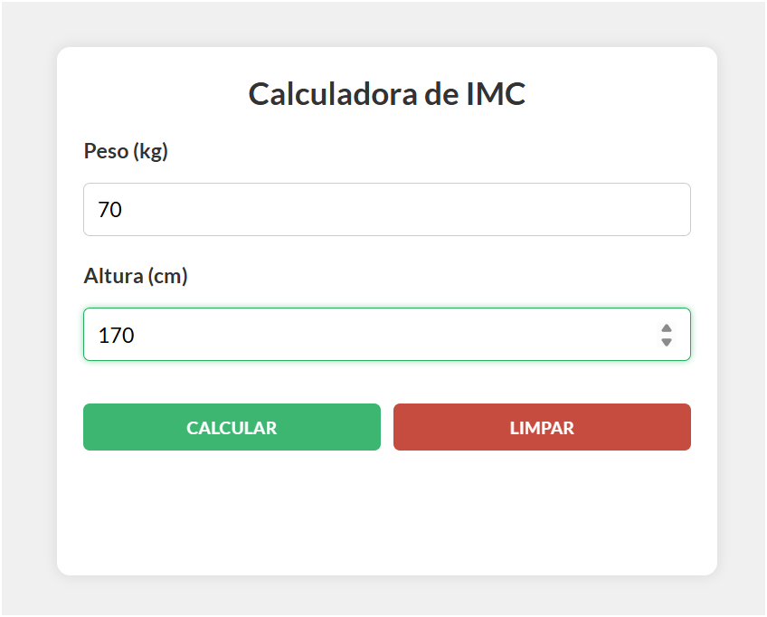
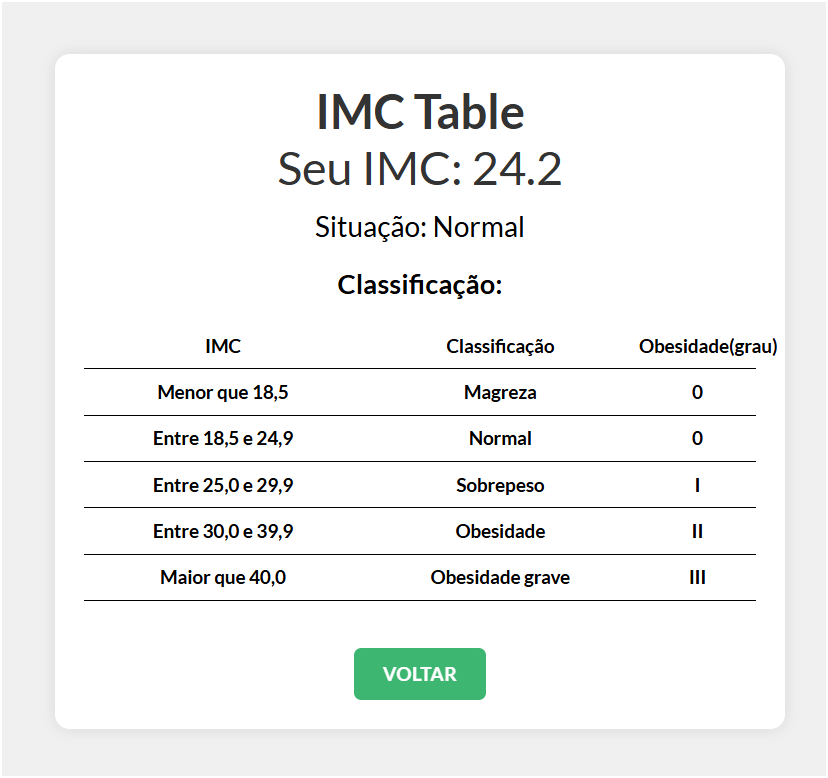

# React + Vite
Uma simples calculadora de imc...

## Funcionalidades

- Calcular o seu imc
  
## Screenshots




## Rodando localmente
Clone o projeto

```bash
  git clone  https://github.com/Henrique1601/imc_react
```

Entre no diretório do projeto backend e frontend e Instale as dependências
```bash
  cd imc_react 
  npm install
```

## Stack utilizada

**Front-end:** HTML, CSS, JavaScript, React

## Autores

- [@HenriqueBezerra](https://github.com/Henrique1601)